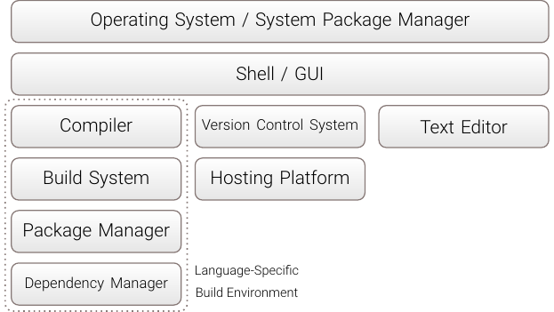

# Basic Toolchain

## Notes on Integrated Development Environments

Integrated Development Environments (IDEs) are software applications for computer programmers to support the process of writing and debugging code. They merge independent software development tools, such as source code editors, build automation tools, and debuggers, together in one bigger application. But there is no clear boundary if something should be called an IDE or a supporting tool.

In general, the usage of an IDE will simplify installing the environment and will speed up code refactoring. IDEs tend to use up a huge amount of memory on the RAM. For a beginner, lots of things are made too simple so that learning is not really possible. A typical solution is a mini IDE.

In the following, the basic toolchain for a C++ project will be shown. Every part will be discussed as an independent tool. This explains the interaction. If one should use a full-blown IDE or a mini IDE is left to the reader.

Click on the image to get the according PDF.

## Operating System

<!-- **Recommendation:** Use a Linux distribution. -->
!!! abstract "Recommendation"
    Use a Linux distribution.

<!-- **Explanation:** -->
The operating system is the most basic part of the development environment and is used in every single stage of a software project.
Hence, it should support the development workflow in such a way that the programmer should not realize its existence.
Therefore an ideal operating system for development would fulfill the following conditions.

- lightweight (older hardware should be capable of running this system)
- optimized for the hardware it is used on
- fast installation to new hardware
- fast booting and shutdown
- short response times (user should not wait)
- efficient interaction and communication with user (for example via a terminal through keyboard)
- capable of graphical output (humans are more attracted to nice looking designs)
- fast internet browsing for research
- fast installation of new packages and tools from modern repositories
- easily upgradeable without being forced to
- good defaults so no real configuration is needed
- compatibility to all development tools
- easy to learn for newcomers
- open source system / providing ways to use open source software
- free to use

In reality there is no operating system which fulfills all these conditions.
As a consequence we look for the best subset.
In our experience any Linux distribution seems to be a really good candidate.
Most Linux distributions are lightweight, easy to install, fast to boot and shutdown and free to use.
With nearly every distribution coding and installing tools can be done without problems.
Upgrading a Linux distribution can be done manually.
Choosing a specific Linux distribution is a matter of taste.
But we recommend one of the following.
- Ubuntu/Debian-based (Ubuntu, Debian, Mint)
- Arch-based (Arch, Manjaro)

## Shell

<!-- **Recommendation:** -->
!!! abstract "Recommendation"
    Use a modern and efficient shell, like `fish`, `elvish`, `ion`, or try to adhere to the standard with `bash` or `zsh`.

<!-- **Explanation:** -->
The shell is one of the most frequently used applications while developing.
It is a user interface to access the services of an operating system and therefore the only possibility for a user besides the GUI to communicate with the operating system.
Because of that the shell usage has to be highly optimized such that it not intervenes with the thought process or the actual development workflow.
There are some resulting conditions a shell should fulfill.

- lightweight and fast to startup
- multiple instances
- easy scripting with easy syntax
- ease to learn for newcomers
- features that support navigation and search
- short response times
- good history tracking and usage
- easy configuration
- good defaults so no configuration is needed
- high availability on different systems
- independent of the operating system
- good handling of environment variables

Again, there is no shell which fulfills every condition.
Our suggestion is to think about modern alternatives.

- `fish`: easy to install, learn, use and script with support for all systems
- `elvish`: efficient with good features for history and navigation
- `xonsh`: superset of python and currently in development
- `ion`: really efficient

But if you really want to have high availability of your shell then you should stick to `bash`, `zsh` or `dash`.

## Version Control System

<!-- **Recommendation:** -->
!!! abstract "Recommendation"
    Use `git` as your version control system.

<!-- **Explanation:** -->
Version control is a system that records changes to a file or set of files over time so that you can recall specific versions later.
Therefore a version control system is versatile alternative to the plain old backup process which makes it indispensable while working on the code for a project.
`git` is widely used and represent the standard.

## Text Editor

<!-- **Recommendation:** -->
!!! abstract "Recommendation"
    Use `Sublime Text`, `Atom` or `Visual Studio Code` as your main general-purpose graphical text editor with your custom configurations and snippets.
    Use simple and standard command-line editors like `vim` or `emacs` for editing configuration files in place if there is only a command-line available.

<!-- **Explanation:** -->
As a software developer your major work will have to do with source code.
In general one uses a text editor to display code to work on it.
Because of this the text editor has to be highly optimized like in the case of the shell.

- lightweight and fast (multiple instances)
- really efficient user interaction via keyboard and shortcuts (programmer has to work with the keyboard anyway)
- project handling (working on different projects at the same time)
- good interaction with shell (shell access should be fast)
- highly customizable through configurations and packages
- good defaults such that configuration is not really needed
- easy and fast package installation process
- simple and attractive design
- easy to learn for newcomers
- integrated build systems when needed
- useful for different languages

## Compiler

<!-- **Recommendation:** -->
!!! abstract "Recommendation"
    Use GCC compiler `g++`, LLVM compiler `clang` and Intel C++ compiler `icpc`.
    On Windows use MinGW compiler `g++`.

## Build System and Package Manager

<!-- **Recommendation:** -->
!!! abstract "Recommendation"
    For your own smaller projects use a modern build system with support for package managers, like `build2`.
    For larger projects use modern `CMake` and think about providing support for `build2`.

## Version Control System Server

<!-- **Recommendation:** -->
!!! abstract "Recommendation"
    Use an external hosting platform, such as GitHub or Bitbucket, or set up your own server, like Gitea.

There are no real boundaries when choosing the hosting platform for your code repositories handled by the version control system.
External hosting platforms, such as GitHub, Bitbucket, or GitLab, provide an easy web interface and are reliable with nearly no configuration needed.
On the contrary, your code repositories may be private and you do not want them to reside on an external cloud storage.
An alternative would be to set up your own Git server providing necessary storage and web access.
A good choice for Git would be to use Gitea, which is a lightweight, fast, and easy-to-set-up self-hosted Git server platform.
Other alternatives include GitLab, GitWeb, and Gogs.
If the web access is not needed, one can completely rely on the file system of the host computer without setting up any hosting platform.
In the case of a self-hosted platform, one should further consider security issues, like HTTPS, and backup procedures, such as RAID.