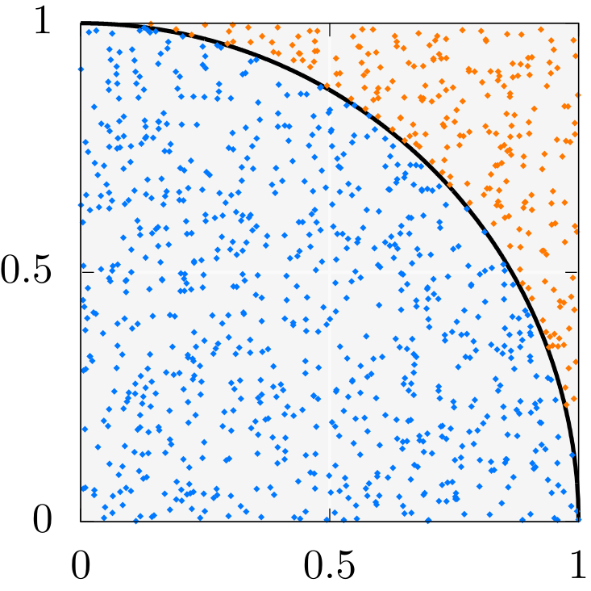

# 12. Monte-Carlo π

In the last few sections, we have introduced the tools for a basic toolchain every C++ project will eventually need.
But even for a basic toolchain, it seemed to be overwhelming.
Hence, we will use the next project to actually get back to rules and learn how to integrate those tools in our workflow without thinking too much about them.

For this, we will get our hands on random numbers and in the next lesson on time measurement facilities.
It seems to be weird, to use random numbers in a computer program and the question arises, why we would actually care about them.
Indeed, the topic of random number generation is not simple.
The answer lies again in mathematics.
Using probability and complexity theory, it can be shown that algorithms using random numbers are sometimes much more efficient than their deterministic counterparts.

Let us get clear on the technical terms.
We call an algorithm which somehow uses random numbers a Monte-Carlo algorithm.
All other algorithms are called deterministic algorithms.
This is based on a simple but powerful observation.
Deterministic algorithms will at all times give you the same output for the same input value.
On the hand, every call of a Monte-Carlo algorithm may return a slightly changed end result which approximates the actual solution to a problem.

## Random Numbers and the Estimation of π

To get in touch with Monte-Carlo algorithms, we will implement the "Hello, World!" example of randomized algorithms.
We will try to estimate $\pi$.



Take a look at the image and consider the upper-right sector of the unit circle.
The area $A$ of a circle with radius $r$ is given by a simple formula.

\[
    A = \pi r^2
\]

For the upper-right sector of the unit circle, the radius $r=1$ and the area is reduced by $4$.
As a result, the area of this sector, let us call it $A_\circ$, is then given as follows.

\[
    A_\circ = \frac{\pi}{4}
\]

This formula gives you the feeling that we already know $\pi$.
But currently, there is no way to compute the area of the circle.
Now, consider the bounding unit square in the image.
Obviously, its area is $1$.
If there is a routine in our program, like `#!c++ random()`, which allows us to draw a random number uniformly distributed in the interval $[0,1]$, then we can easily generate uniformly distributed random points in the unit square by calling `#!c++ random()` once for the $x$ coordinate of the point and once for the $y$ coordinate of the point.
Uniformly distributed in this sense means that every possible value has the same probability to be generated.
You have to think of the function `#!c++ random()` as an oracle which magically tells you "the right" random numbers when you ask it.

To this point, we have no clue on how to guess the area $A_\circ$.
But there is a straightforward characteristic of the circle which can be used.
The distance to the origin $d$ for every point $p$ that lies in the circle has to be smaller than its radius, here $1$.
This distance can be computed by the famous Pythagorean theorem.

\[
    d = \sqrt{p_x^2 + p_y^2}
\]

The idea is to count the number $n_\circ$ of randomly generated points that lie inside the circle.
We will then relate the quotient of the number $n_\circ$ of points inside the circle and the whole number $n$ of points to the quotient of their respective areas $A_\circ$ and $A_\square$.
Because the area of the square is $1$, the "equation" would look like the following.

\[
    \frac{n_\circ}{n} \stackrel{\sim}{=} \frac{A_\circ}{A_\square} = \frac{\pi}{4}
\]

Of course, this statement is not a real equation.
We are not allowed to construct equations how we would like them to be.
But in probability theory, the variable $\frac{n_\circ}{n}$ is typically seen as a random variable with an abstract expectation value.
To not go into too much details, it can be shown that in a statistical sense for a very large amount of points $n$ this variable indeed approaches the value of $\frac{\pi}{4}$.
So, for us, this means, we will generate a huge amount of random points in the square and test them if they are lying inside the circle.
Getting the number of points inside the circle will then allow us to provide an estimation of $\pi$.

## Starting a New Project with Other Tools in Mind

After this small excursion in the theory of Monte-Carlo methods, let us start a new project.
This time, we will directly start with Git.

    $ git init monte-carlo-pi
    $ cd monte-carlo-pi

We have created a new repository for our project.
This should always be the starting point.
But for the next few thoughts, we can forget about Git.
We will only use it when we really need it.

For nearly all C++ projects, the focus should lie on the development of the C++ code itself.
So please, create a `main.cpp` file.

    $ touch main.cpp

It sounds a little bit silly, but to test if everything on the computer is working fine, let us start AGAIN with a "Hello, World!" program.

**main.cpp**
```c++
#include <iostream>
using namespace std;
int main(){
  cout << "Hello, World!\n";
}
```

Compile and run it.

    $ g++ -o main main.cpp
    $ ./main
    Hello, World!

Let us now start with the generation of random numbers.
The header file `random` of the C++ standard template library already gives us a lots of facilities to generate them.

**main.cpp**
```c++
#include <iostream>
#include <random>
using namespace std;
int main() {
  random_device rd{};
  mt19937 rng{rd()};
  uniform_real_distribution<float> dist{0, 1};

  const int n = 10;
  for (int i = 0; i < n; ++i)
    cout << dist(rng) << '\n';
}
```

Now, that is a lot.
We will go through every detail but first compile and run the code to make sure the are no typos.

    $ g++ -o main main.cpp
    $ ./main
    0.864357
    0.523781
    0.276156
    0.33275
    0.397129
    0.407622
    0.519735
    0.187027
    0.568677
    0.923395

When running the program it outputs ten random numbers uniformly distributed between $0$ and $1$.
Hopefully, every time the program is called other random numbers should appear.
This is the typical characteristic of an oracle.

So, what happens here?
For this, we need to understand how the computer is generating random numbers.
The process is separated into three stages.
The first one attains a so-called seed, an initial value that should be truly random.
Truly random means that this value results from a chaotic physical process, typically temperature fluctuations.
At this point, we could ask why we do even bother with two other stages when we already got a possibility to draw truly random numbers.
The true random number generators built into a computer are typically much too slow for Monte-Carlo simulations.
Furthermore, there are other reasons why we would not like to have only truly random numbers.
In C++, we do this by constructing an object `rd` of type `#!c++ random_device` and by using its function operator.

The second stage is a so-called pseudorandom number generator because it computes random numbers based on an algorithm which are then by definition not truly random.
But the algorithm is designed to be in some sense unpredictable and to generate a sequence of numbers which is hard to distinguish from a truly random sequence of numbers.
And as said before, a pseudorandom number generator can generate "random" numbers much faster.
Nevertheless, the pseuderandom number generator uses the truly random seed from the first stage to introduce actual randomness in its own output.
But it is expanding this randomness from one value to a whole sequence of values.
In C++, one typically uses the Mersenne twister which is de-facto standard of pseudorandom number generators.
We construct an object `rng` of type `mt19937` and initialize it with a value from `rd` by calling `rd()`.
At this point, we can forget about `rd`.

Last but not least, we have to consider the third stage.
Until now, the random number generators are only working with abstract integer numbers that have nothing in common with real numbers uniformly distributed in $[0,1]$.
As a consequence, in most cases, we have to use distributions.
They are providing a transformation from those abstract integral numbers to our target domain.
In C++, many distributions are possible and not only the uniform distribution.
But we will only construct an object `dist` of type `uniform_real_distribution<float>`.
The arguments provide the interval for random numbers.
Please note, we do not use any seed value or random number from the other two stages.
The distribution has to be applied every time we want to get random numbers from `rng`.
Hence, we construct a random number by calling `dist(rng)`.

Now, we have cleared one goal for our new project: To successfully generate random numbers.
Let us seal the deal by making a commit to have a backup if something in the future goes wrong.
Currently, there is no need for `.gitignore` file.
Let us only add the newly created `main.cpp` file.

    $ git status                        # optional
    $ git add main.cpp
    $ git status                        # optional
    $ git commit -m "Initial commit"
    $ git status                        # optional
    $ git log                           # optional

Again, we have used Git at the right time only for a short moment and are now forgetting about it again.
Let us head over to the next part.

## Lambda Expression as Simplification

**main.cpp**
```c++
#include <iostream>
#include <random>
using namespace std;
int main() {
  random_device rd{};
  mt19937 rng{rd()};
  uniform_real_distribution<float> dist{0, 1};
  const auto random = [&]() { return dist(rng); }

  const int n = 10;
  for (int i = 0; i < n; ++i)
    cout << random() << '\n';
}
```

## Estimating π

```c++
#include <iostream>
#include <random>
using namespace std;
int main() {
  random_device rd{};
  mt19937 rng{rd()};
  uniform_real_distribution<float> dist{0, 1};
  const auto random = [&]() { return dist(rng); }

  const int n = 10'000'000;
  int c = 0;
  for (int i = 0; i < n; ++i){
    auto x = random();
    auto y = random();
    auto r2 = x * x + y * y;
    if (r2 < 1) ++c;
  }
  auto pi = 4 * float(c) / float(n);
  cout << "pi = " << pi << '\n';
}
```

## Tweaking the Program

**main.cpp**
```c++
#include <iostream>
#include <random>

using namespace std;

int main() {
  mt19937 rng{random_device{}()};
  uniform_real_distribution<float> dist{0, 1};
  const auto random = [&]() { return dist(rng); }

  const int n = 10'000'000;
  int c = 0;
  for (int i = 0; i < n; ++i){
    const auto x = random();
    const auto y = random();
    if (x * x + y * y < 1) ++c;
  }
  const auto pi = 4.0f * c / n;
  cout << "pi = " << pi << '\n';
}
```